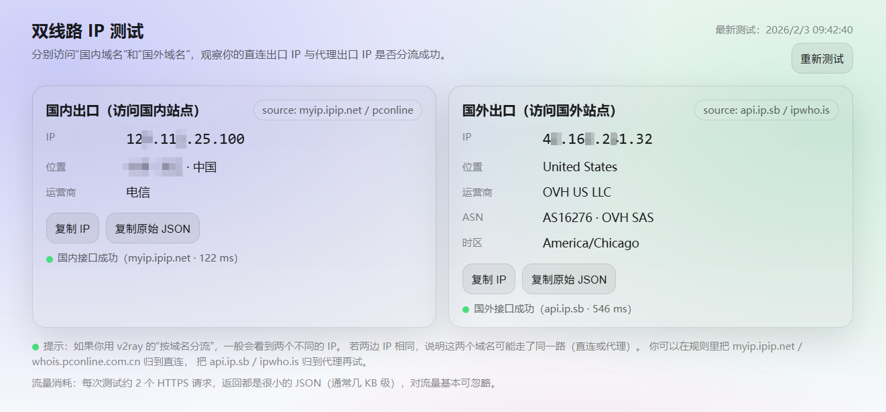

# 双线路 IP 测试（CN / Global）

一个极简网页工具：分别请求一个**国内接口**和一个**国外接口**，用来观察当前浏览器在「直连/分流」与「代理」场景下的出口 IP 是否符合预期。

适合：
- 使用 ZeroOmega / v2ray / Clash 等代理与分流规则时，快速验证 **国内出口 IP** 与 **国外出口 IP**
- 快速查看 IP 的地理位置、运营商/ISP、ASN 等信息

## 在线访问

- 访问地址：<你的 GitHub Pages 链接，填这里>
  - 示例：[https://qinheart.github.io/ip-test/](https://qinheart.github.io/ip-test/)

> 刷新页面或点击“重新测试”会重新发起请求并更新结果与测试时间。

## 截图

## 数据来源

- 国内：`myip.ipip.net`（备用：`whois.pconline.com.cn`）
- 国外：`api.ip.sb`（备用：`ipwho.is`）

## 注意事项

- 建议通过 `https://` 访问（GitHub Pages），不要用 `file://` 直接打开本地文件，部分接口可能会因 CORS/Origin 限制导致失败。
- 分流效果取决于你的代理/规则配置：如果国内/国外显示的 IP 一样，通常说明相关域名被路由到了同一路（直连或代理）。
- 流量消耗很小：每次测试约 2 个 HTTPS 请求，返回为几 KB 级 JSON。
